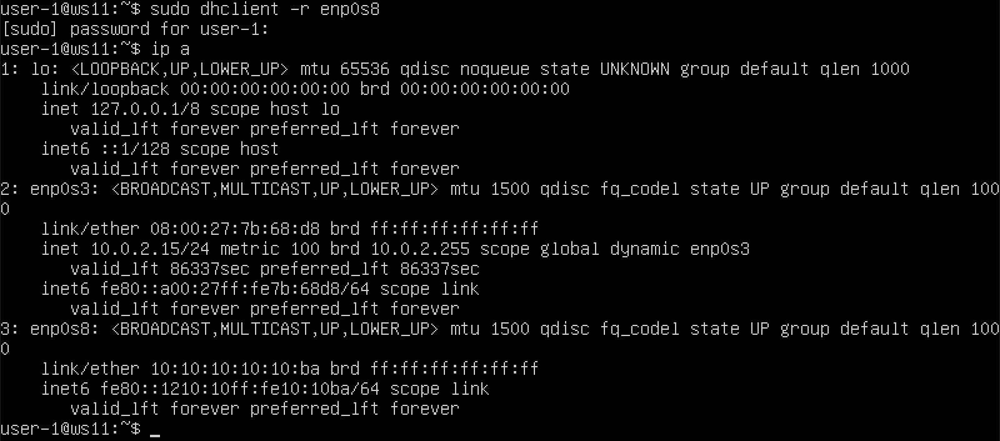
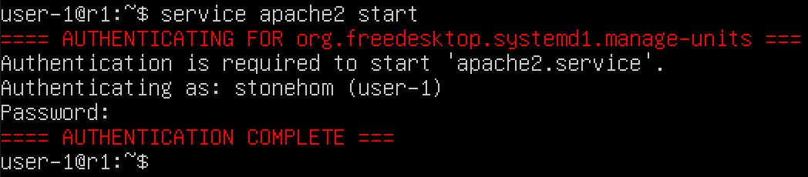

# Linux Network


## 0. Что такое сеть?

Сеть — это способ, с помощью которого компьютеры и устройства обмениваются информацией. Представьте, что у вас есть два компьютера, и вы хотите передавать данные с одного на другой. Для этого компьютеры должны быть связаны через какие-то каналы связи (например, через кабели или беспроводную сеть) и следовать определённым правилам, чтобы правильно понимать друг друга. Эти правила называются протоколами.


## 1. Что такое стек протоколов TCP/IP?

**TCP/IP** — это набор таких правил, которые помогают компьютерам обмениваться данными через сеть. "Стек протоколов" можно представить как башню, где каждый уровень отвечает за свою задачу. Например, один уровень отвечает за то, как данные разбиваются на части, а другой — за то, как найти правильный путь для этих данных через сеть.

Вот почему мы используем не один, а много протоколов. Каждый из них решает свою задачу, и все вместе они обеспечивают успешный обмен информацией.

## Пример из жизни

Представьте себе отправку письма по почте. Процесс доставки письма очень похож на передачу данных через сеть.

1. **Письмо (данные)**: Вы написали письмо — это те данные, которые нужно передать. Например, текст сообщения или файл.

2. **Конверт (протокол)**: Вы кладете письмо в конверт и пишете на нём адрес. Это как упаковка данных в протокол. Протокол следит за тем, чтобы данные были упакованы правильно и могли быть доставлены.

3. **Почта (маршрутизация)**: Почта выбирает наилучший маршрут для доставки вашего письма. Так же и в сети — данные передаются через разные маршруты, чтобы достичь нужного компьютера.

4. **Доставка (TCP/IP)**: Наконец, почтальон доставляет письмо к двери получателя, и вы получаете уведомление о доставке (это как подтверждение доставки данных).

## Почему несколько уровней?

Использование разных уровней помогает упростить процесс. Если бы почтальону пришлось заниматься и упаковкой писем, и доставкой, и ремонтом почтовых ящиков, это было бы очень сложно. Вместо этого у каждого есть своя задача: один упаковывает письма, другой доставляет, третий следит за почтовыми ящиками.

Точно так же и в стеке протоколов TCP/IP каждый уровень решает свою задачу. Например, один уровень отвечает за надёжность передачи данных, другой — за нахождение пути в сети.


## 2. Модель OSI

Для удобства работы с этими уровнями была разработана модель OSI (англ. Open Systems Interconnection Basic Reference Model, 1978 года, она же — базовая эталонная модель взаимодействия открытых систем), которая делит процесс передачи данных на 7 уровней. Это как инструкции по шагам: от момента, когда вы написали письмо (данные), до момента, когда оно пришло к получателю.

Пример уровней модели OSI:
1. **Физический уровень** — отвечает за реальное физическое соединение, например, за кабель или радиоволны.
2. **Канальный уровень** — проверяет, что данные правильно проходят через соединение.
3. **Сетевой уровень** — отвечает за маршрутизацию, то есть за то, чтобы данные нашли правильный путь.
4. **Транспортный уровень** — следит за тем, чтобы данные пришли целыми и без ошибок.
5. **Сеансовый уровень** — управляет сеансами связи (то есть как долго держится соединение).
6. **Представительский уровень** — переводит данные в формат, который понимают обе стороны.
7. **Прикладной уровень** — это то, что видит пользователь, например, веб-сайт или электронная почта.

Таким образом, каждый уровень делает свою работу, а вместе они позволяют компьютерам обмениваться данными.

## В итоге

TCP/IP — это набор правил, которые помогают компьютерам взаимодействовать в сети. Он работает по принципу "разделяй и властвуй", где каждый уровень отвечает за свою часть работы. Это как работа почтовой службы, где каждый делает свою задачу, чтобы письмо (или данные) доставлялись вовремя и без ошибок.


## 3. Что такое IP-адрес и как он работает?

IP-адрес (IPv4) — это уникальный идентификатор устройства в сети, состоящий из четырёх чисел, каждое из которых может быть от 0 до 255, например, `192.168.0.1`. Если представить себе город, то IP-адрес — это как адрес здания. Но в случае сети, адрес не только указывает на само здание (устройство), но и на район города (сеть), в котором это здание находится.

### Как делится IP-адрес?

IP-адрес можно разделить на две части:
1. **Адрес сети (Network ID)** — это часть адреса, которая определяет саму сеть (аналогия с районом города).
2. **Адрес хоста (Host ID)** — это часть, которая указывает на конкретное устройство (аналогия с номером здания в этом районе).


 > 
На картинке выше показано, что IP-адрес делится на части. Например:
- `192.168.5.1` — это IP-адрес.
- Часть `192.168.5` — это адрес сети.
- Часть `1` — это адрес конкретного устройства в этой сети (хоста).


## 4. Что такое маска сети?

Маска сети — это инструмент, который помогает разделить IP-адрес на две части: **сеть** и **хост** (устройство, подключенное к этой сети). Она говорит устройствам в сети, какая часть IP-адреса принадлежит самой сети, а какая часть может быть изменена для назначения устройствам (хостам) внутри этой сети.

### Представим себе улицу:

- **Сеть** — это как улица с домами. Все дома на этой улице имеют одинаковый адрес улицы (например, "ул. Сети").
- **Хосты** — это дома на этой улице, и у каждого дома есть свой номер.

Маска сети помогает понять, где заканчивается название улицы (сеть) и начинается нумерация домов (хосты).

### Как работает маска сети?

- **IP-адрес** — это просто число, состоящее из 32 бит (для IPv4).
- **Маска сети** говорит, какая часть этих 32 бит указывает на сеть (улицу), а какая часть указывает на конкретное устройство (дом) внутри этой сети.

### Пример

Рассмотрим IP-адрес `192.168.1.10` с маской сети `255.255.255.0`.

- **IP-адрес** в двоичном виде: `11000000.10101000.00000001.00001010`
- **Маска сети** в двоичном виде: `11111111.11111111.11111111.00000000`

Маска сети говорит: "Первые 24 бита (те, где стоят 1) — это сеть, а последние 8 бит (те, где стоят 0) — это хосты в этой сети".

- **Сеть**: `192.168.1.0` (это как название улицы).
- **Хосты**: от `192.168.1.1` до `192.168.1.254` (это дома на этой улице).

### Простое объяснение:

- **Маска сети** — это как забор, который отделяет одну сеть (улицу) от другой.
- Она говорит: "Вот эта часть адреса принадлежит сети, и все устройства в этой сети будут иметь одинаковую эту часть адреса".
- Все устройства в одной сети могут напрямую общаться друг с другом. Если нужно выйти за пределы этой сети, требуется маршрутизация (то есть нужно пересечь забор).

### Зачем нужна маска сети?

- Маска сети используется, чтобы определить, к какой сети принадлежит устройство.
- Она помогает устройствам понять, могут ли они отправить данные напрямую друг другу или им нужен маршрутизатор, чтобы передать данные в другую сеть.


Маска подсети — это инструмент, который помогает определить, где заканчивается адрес сети и начинается адрес хоста. Маска состоит из тех же четырёх чисел, что и IP-адрес, но она выглядит как последовательность единиц и нулей. Единицы указывают на часть IP-адреса, которая относится к сети, а нули — на часть, которая относится к хосту.

На картинке видно, что маска подсети для сети `192.168.5.0` — это `255.255.255.0`. Это значит, что первые три числа (`192.168.5`) — это сеть, а последнее (`1`) — это хост.

### Как это помогает?

Когда устройство получает данные, оно использует маску подсети, чтобы понять, отправлять ли данные в свою сеть или в другую. Если данные предназначены для устройства в той же сети, они отправляются напрямую. Если данные предназначены для устройства в другой сети, их нужно отправить через роутер (маршрутизатор).

### Протоколы TCP и UDP

Теперь немного о портах и протоколах. Помимо IP-адресов, для связи между устройствами используются порты. Порт — это как почтовый ящик в здании, который отвечает за конкретное приложение. Например:
- Порт 80 — обычно используется для веб-трафика (HTTP).
- Порт 22 — используется для удалённого доступа (SSH).

Протоколы **TCP** и **UDP** работают поверх IP-протокола и управляют передачей данных:
- **TCP** (Transmission Control Protocol) обеспечивает надёжную передачу данных. Представьте, что это как отправка посылки с уведомлением о доставке: отправитель знает, что посылка дошла.
- **UDP** (User Datagram Protocol) менее надёжен, но быстрее. Это как отправка письма без уведомления: оно может дойти, а может и нет, но делается это быстрее.

### Пример с городом

Представьте, что сеть TCP/IP — это целый город:
- **Сети и подсети** — это районы и улицы.
- **IP-адреса** — это адреса зданий на улицах.
- **Порты** — это номера почтовых ящиков в зданиях.
- **TCP и UDP** — это курьерские службы, которые доставляют посылки в эти почтовые ящики.

Когда данные передаются через сеть, они "упаковываются" в конверты (IP-пакеты), на которых указаны адрес отправителя (IP и порт) и адрес получателя (IP и порт). IP-протокол отвечает за то, чтобы найти правильный путь для доставки данных через город (сеть), а TCP или UDP следят за тем, чтобы данные были доставлены корректно.


## 5. Маска сети и маска подсети. Что такое маска сети и чем она отличается от маски подсети?

Термины **маска сети** и **маска подсети** (или **сетевая маска** и **маска подсети**) часто используются взаимозаменяемо, но в некоторых контекстах они могут означать немного разные вещи. Давай разберем их более подробно.

### Маска сети (Netmask)

**Маска сети** — это число, которое помогает разделить IP-адрес на две части: сетевая часть и хостовая часть. Маска сети указывает, какая часть IP-адреса принадлежит сети (фиксирована для всех устройств в сети), а какая часть может варьироваться для каждого хоста (устройства) в этой сети.

### Пример маски сети:

- Например, для IP-адреса `192.168.1.10` с маской сети `255.255.255.0`:
  - **Маска сети** в двоичной форме: `11111111.11111111.11111111.00000000`
  - Первые 24 бита (часть, соответствующая `255.255.255.0`) определяют сеть.
  - Оставшиеся 8 бит указывают на хостов внутри этой сети.

### Маска подсети (Subnet Mask)

**Маска подсети** — это частный случай маски сети, который используется для создания подсетей внутри уже существующей сети. Маска подсети также делит IP-адрес на сетевая и хостовую части, но может быть настроена более гибко для создания меньших сетей (подсетей) внутри большей сети.

#### Пример маски подсети:

- В сети с IP-адресом `192.168.1.0` и маской сети `255.255.255.0` можно создать несколько подсетей, например, с маской `255.255.255.128` (префикс `/25`).
  - В этом случае маска подсети `255.255.255.128` делит сеть на две подсети: одна будет с IP-адресами от `192.168.1.0` до `192.168.1.127`, а другая — от `192.168.1.128` до `192.168.1.255`.

### Основные различия:

1. **Маска сети** — это общее понятие, которое относится к процессу разделения любого IP-адреса на сетевая и хостовую части.
   - Маска сети определяет, где заканчивается сеть и начинаются хосты.

2. **Маска подсети** — это разновидность маски сети, которая используется для дальнейшего деления уже существующей сети на несколько более мелких сетей (подсетей).
   - Маска подсети может быть короче маски исходной сети, если нужно создать несколько подсетей.

### Когда используются термины:

- **Маска сети** используется для обозначения общего механизма деления сети.
- **Маска подсети** часто используется в контексте деления существующей сети на меньшие подсети.

В практическом использовании оба термина могут применяться взаимозаменяемо, поскольку они оба выполняют задачу разделения IP-адресов на сетевая и хостовую части.


### Подведем итог:

**Маска сети** — это способ сказать устройству: "Вот эта часть IP-адреса определяет твою сеть (где ты находишься), а вот эта часть — это твой уникальный номер внутри этой сети".


## 6. Что такое маршрутизация и зачем она нужна?

Когда у вас есть несколько устройств в сети (например, компьютеры, серверы), они должны уметь отправлять и получать данные друг от друга. Но когда устройств много и они находятся в разных частях сети (или даже в разных сетях), им нужно понимать, как найти друг друга. Для этого и существует **маршрутизация**.

### Как работает маршрутизация?

Каждое устройство в сети (будь то компьютер, телефон или сервер) имеет свою таблицу маршрутизации. Это как карта, на которой указаны маршруты для отправки данных. Когда устройство хочет отправить данные другому устройству, оно смотрит в свою таблицу маршрутизации, чтобы узнать, куда эти данные отправить.

Маршрутизаторы (шлюзы) — это устройства, которые соединяют разные сети и помогают направлять данные между ними. Они выполняют роль "почтового офиса", который направляет данные (пакеты) в нужное место.

### Как данные находят свой путь?
 > 

Когда компьютер отправляет данные, он смотрит на IP-адрес получателя и использует таблицу маршрутизации, чтобы решить, куда эти данные отправить. Если данные предназначены для устройства в той же сети, они отправляются напрямую. Если для устройства в другой сети, данные отправляются через ближайший маршрутизатор, который уже знает, как их дальше передать.

На схеме видно, что между разными частями сети (сеть `128.17.112.0/24` и сеть `128.17.75.0/24`) стоят маршрутизаторы `pineapple` и `papaya`. Эти устройства соединяют разные сети и помогают передавать данные между ними.

### Пример работы таблицы маршрутизации

Допустим, устройство `eggplant` из сети `128.17.75.0/24` хочет отправить данные на устройство `pear` в сети `128.17.112.0/24`. Чтобы это сделать, оно смотрит в свою таблицу маршрутизации. В таблице указано, что для сети `128.17.112.0/24` нужно отправить данные через маршрутизатор `128.17.75.20`. Этот маршрутизатор уже знает, как передать данные дальше, чтобы они дошли до `pear`.

### Пример таблицы маршрутизации

Таблица маршрутизации выглядит примерно так:

```bash
[root@eggplant ~]# netstat -rn
Kernel IP routing table
Destination     Gateway         Genmask         Flags   MSS Window  irtt Iface
128.17.75.0     128.17.75.20    255.255.255.0   UN      1500 0      0 eth0
default         128.17.75.98    0.0.0.0         UGN     1500 0      0 eth0
127.0.0.1       127.0.0.1       255.0.0.0       UH      3584 0      0 lo
128.17.75.20    127.0.0.1       255.255.255.0   UH      3584 0      0 lo
```

- **Destination (назначение):** Адреса сетей или устройств, куда могут быть отправлены данные.
- **Gateway (шлюз):** Адрес маршрутизатора, через который данные должны пройти, чтобы попасть в назначенную сеть.
- **Genmask (маска подсети):** Определяет размер сети, к которой относится указанный адрес.
- **Flags:** Указывают, что маршрут активен (`U`), используется для сети (`N`) или для конкретного устройства (`H`).
- **Iface (интерфейс):** Сетевой интерфейс, который будет использоваться для передачи данных.

Таким образом, маршрутизация помогает устройствам в сети находить друг друга и правильно передавать данные даже через несколько сетей.


## 7. Хостовая часть IP-адреса
Хостовая часть IP-адреса — это та часть, которая определяет уникальный адрес устройства внутри одной сети. Маска сети отделяет сетевую часть IP-адреса от хостовой, определяя, сколько устройств может быть в этой сети и какие конкретно IP-адреса они могут использовать.

Маска сети говорит: "Вот это часть адреса сети".
Хостовая часть говорит: "А это уникальный идентификатор для каждого устройства в этой сети".


Хост (host) в контексте сетевых технологий — это любое устройство, подключённое к сети, которое имеет IP-адрес и может отправлять и получать данные. Это может быть компьютер, сервер, маршрутизатор, смартфон, принтер и т. д.

Основные характеристики хоста:

1. **IP-адрес**: Каждому хосту в сети назначается уникальный IP-адрес, который позволяет идентифицировать его среди других устройств. IP-адрес может быть как публичным (доступен в интернете), так и частным (доступен только внутри локальной сети).

2. **Роль в сети**: Хост может выполнять различные функции в сети. Например, он может быть клиентом, запрашивающим ресурсы, или сервером, предоставляющим их.

3. **Протоколы связи**: Хосты взаимодействуют друг с другом с помощью сетевых протоколов, таких как TCP/IP, которые стандартизируют процесс передачи данных.

Пример:
- В домашней сети компьютеры и смартфоны являются хостами. Каждый из них подключён к маршрутизатору, и у каждого есть свой IP-адрес, чтобы они могли взаимодействовать друг с другом и с интернетом.

В нашей текущей задаче, когда мы работаете с IP-адресами и масками сети, хосты — это те устройства, которые могут использоваться для передачи данных в пределах заданной сети.


## 8. Сетевая часть IP-адреса

**Сетевая часть IP-адреса** — это та часть IP-адреса, которая определяет, к какой сети принадлежит конкретное устройство. Все устройства, находящиеся в одной сети, имеют одинаковую сетевую часть в своих IP-адресах.

### Хостовая часть IP-адреса

**Хостовая часть IP-адреса** — это та часть IP-адреса, которая используется для идентификации конкретного устройства (хоста) внутри этой сети. Каждый хост в сети имеет уникальную хостовую часть, что позволяет различным устройствам внутри одной сети иметь разные IP-адреса.

### Разница между сетевой и хостовой частями

1. **Сетевая часть**:
   - **Что она делает**: Определяет саму сеть, к которой принадлежит IP-адрес.
   - **Как используется**: Устройства используют сетевую часть, чтобы понять, находятся ли они в одной сети. Если два устройства имеют одинаковую сетевую часть в IP-адресе, они находятся в одной сети и могут общаться напрямую без необходимости проходить через маршрутизатор.
   - **Пример**: В сети `192.168.1.0/24` сетевой частью для всех устройств будет `192.168.1`. Устройства с IP-адресами `192.168.1.10` и `192.168.1.20` имеют одну и ту же сетевую часть (`192.168.1`), значит, они находятся в одной сети.

2. **Хостовая часть**:
   - **Что она делает**: Определяет конкретное устройство в пределах сети.
   - **Как используется**: Хостовая часть уникальна для каждого устройства в сети. Она позволяет различным устройствам в одной сети иметь уникальные IP-адреса.
   - **Пример**: В той же сети `192.168.1.0/24`, хостовые части могут быть `10` и `20` для устройств с IP-адресами `192.168.1.10` и `192.168.1.20` соответственно.

### Как это работает на практике

- Когда устройство (например, компьютер или маршрутизатор) получает IP-пакет, оно смотрит на сетевую часть адреса назначения. Если сетевая часть адреса назначения совпадает с сетевой частью адреса отправителя, это значит, что устройство назначения находится в той же сети, и пакет можно отправить напрямую.
- Если сетевая часть отличается, пакет отправляется через маршрутизатор, который перенаправляет его в нужную сеть.

### Пример

Возьмем IP-адрес `192.168.1.10` с маской сети `255.255.255.0` (это /24):

- **Сетевая часть**: `192.168.1` (первые 24 бита IP-адреса).
- **Хостовая часть**: `10` (последние 8 бит IP-адреса).

В сети `192.168.1.0/24` все устройства будут иметь IP-адреса, начинающиеся с `192.168.1`, что делает их частью одной сети. Но каждый адрес будет иметь свою уникальную хостовую часть, например, `192.168.1.10`, `192.168.1.20`, и так далее.

### Итог

- **Сетевая часть**: Определяет общую часть IP-адреса для всех устройств в сети, чтобы они могли общаться друг с другом напрямую.
- **Хостовая часть**: Уникальная часть IP-адреса, которая позволяет каждому устройству в сети иметь свой собственный IP-адрес.

Этот принцип помогает устройствам определять, находятся ли они в одной сети и могут ли обмениваться данными напрямую, или же им нужно обратиться к маршрутизатору для связи с устройствами в других сетях.


## Какие устройства используют сетевую часть IP, а какие полузуются хостовой ?


Сетевая и хостовая части IP-адреса используются разными устройствами и на разных уровнях сетевого взаимодействия. Давайте рассмотрим, какие устройства используют сетевую часть IP-адреса, а какие — хостовую часть.

### 1. Устройства, использующие сетевую часть IP-адреса

**Сетевая часть IP-адреса** используется для определения, в какой сети находится устройство, и для маршрутизации данных между сетями.

#### Примеры устройств:

- **Маршрутизаторы (Роутеры)**:
  - Маршрутизаторы являются основными устройствами, которые работают с сетевой частью IP-адреса. Они определяют, как пакеты данных должны передаваться между разными сетями. Если сетевая часть IP-адреса назначения отличается от сетевой части IP-адреса отправителя, маршрутизатор перенаправляет пакет в соответствующую сеть.
  
- **Коммутаторы уровня 3 (Layer 3 Switches)**:
  - Коммутаторы уровня 3 также используют сетевую часть IP-адреса для маршрутизации трафика между различными сетевыми сегментами.

- **Шлюзы (Gateways)**:
  - Шлюзы работают на границе между двумя сетями и используют сетевую часть IP-адреса, чтобы определить, куда отправлять пакеты, которые поступают из одной сети и должны быть доставлены в другую.

### 2. Устройства, использующие хостовую часть IP-адреса

**Хостовая часть IP-адреса** используется для идентификации конкретного устройства (хоста) внутри сети. Эта часть уникальна для каждого устройства в пределах одной сети.

#### Примеры устройств:

- **Компьютеры**:
  - Каждый компьютер в сети получает IP-адрес, в котором хостовая часть уникальна. Компьютер использует этот адрес для связи с другими устройствами в сети.

- **Смартфоны и планшеты**:
  - Подобно компьютерам, мобильные устройства получают IP-адреса, и их хостовая часть идентифицирует их в сети.

- **Серверы**:
  - Серверы получают уникальные IP-адреса, и их хостовая часть используется для связи с другими устройствами в сети.

- **Принтеры и сетевые устройства**:
  - Сетевые принтеры и другие устройства, такие как камеры наблюдения или умные домашние устройства, также получают уникальные IP-адреса с уникальной хостовой частью, что позволяет другим устройствам в сети взаимодействовать с ними.

### Как это работает на практике?

- **Маршрутизатор** определяет, к какой сети принадлежит устройство, используя сетевую часть IP-адреса. Если два устройства находятся в разных сетях, маршрутизатор пересылает трафик между этими сетями.
- **Компьютеры, смартфоны и другие конечные устройства** используют свою хостовую часть IP-адреса для получения и отправки данных в пределах своей сети. Всякий раз, когда устройство отправляет данные другому устройству в той же сети, оно использует хостовую часть IP-адреса, чтобы идентифицировать конечного получателя.

### Итог

- **Маршрутизаторы, коммутаторы уровня 3 и шлюзы** в первую очередь работают с сетевой частью IP-адреса для маршрутизации данных между сетями.
- **Компьютеры, серверы, принтеры и другие конечные устройства** используют хостовую часть IP-адреса для идентификации себя в пределах сети и обмена данными с другими устройствами в этой сети.


## Part 1. Инструмент **ipcalc**

- Поднять виртуальную машину (далее -- ws1)
Мануал `ipcalc` можно прочесть [здесь](https://www.opennet.ru/man.shtml?topic=ipcalc&russian=2&category=&submit=%F0%CF%CB%C1%DA%C1%D4%D8+man).
>
> - **Описание `ipcalc`**:
>   - `ipcalc` предоставляет простой метод для вычисления IP-информации хоста. Различные опции определяют, какую информацию `ipcalc` должен вывести на стандартный выход. Могут быть заданы несколько опций. Обрабатываемый IP-адрес всегда должен быть указан. Для большинства операций также требуется сетевая маска или префикс CIDR.
> - **Некоторые из применений `ipcalc`**:
>   - Проверить IP-адрес
>   - Показать рассчитанный широковещательный адрес
>   - Отображение имени хоста, определенного через DNS
>   - Показать сетевой адрес или префикс
> - **Использование**
>   - ipcalc [OPTION]... IP address[/prefix] [netmask]
>


## Команда `ipcalc` в Linux – это утилита для работы с IP-адресами и сетевыми масками. Основное предназначение этой утилиты — помочь пользователям легко вычислять различные параметры сети, такие как:

- Адрес сети (Network address)
- Минимальный и максимальный IP-адрес хостов (HostMin, HostMax)
- Широковещательный адрес (Broadcast)
- Количество доступных хостов в сети (Hosts/Net)
- Преобразование масок между различными форматами (например, из префиксного формата в десятичный)

## Название команды `ipcalc` расшифровывается так:

- **ip** — сокращение от Internet Protocol, то есть это команда, работающая с IP-адресами.
- **calc** — сокращение от calculate, что означает "вычислять".

Таким образом, полное значение команды `ipcalc` можно интерпретировать как "вычисление параметров IP-адреса".

Эта утилита полезна при настройке сетей, когда требуется определить сетевые диапазоны, количество доступных IP-адресов и другие параметры сети.


## 1.1) Сети и маски. Определить и записать в отчёт: адрес сети *192.167.38.54/13*


### Вот результат команды `ipcalc`, которая использовалась для определения сетевого адреса и других параметров для IP-адреса `192.167.38.54/13`. Ниже приведена команда, которая была использована, и все параметры, которые должны быть включены в отчет. Команда:

```bash
ipcalc 192.167.38.54/13
```

  


## Результаты, которые должны быть включены в отчет:

1. **IP-адрес**: `192.167.38.54`
2. **Маска сети (Netmask)**: `255.248.0.0`,Маска сети (Netmask) — это число, используемое для разделения IP-адреса на две части: сеть и хост. Она помогает маршрутизаторам и другим сетевым устройствам понять, какая часть IP-адреса относится к сети, а какая — к устройству (хосту) внутри этой сети. 


   - Префикс: `/13`, Маска сети /13. Префиксная запись /13 означает, что первые 13 бит IP-адреса используются для идентификации сети, а оставшиеся 19 бит — для идентификации хостов в этой сети. В десятичном формате эта маска будет 255.248.0.0.
   - Двоичная запись маски: `11111111.11111000.00000000.00000000`
3. **Wildcard**: `0.7.255.255`
   - Двоичная запись wildcard: `00000000.00000111.11111111.11111111`, Wildcard-маска показывает, какие биты в IP-адресе могут изменяться. Она представляет собой побитовое отрицание (инверсию) сетевой маски
4. **Сеть (Network)**: `192.160.0.0/13`
   - Двоичная запись сети: `11000000.10100000.00000000.00000000`
5. **Минимальный адрес хоста (HostMin)**: `192.160.0.1`
   - Двоичная запись: `11000000.10100000.00000000.00000001`
6. **Максимальный адрес хоста (HostMax)**: `192.167.255.254`
   - Двоичная запись: `11000000.10100111.11111111.11111110`
7. **Broadcast-адрес**: `192.167.255.255`
   - Двоичная запись: `11000000.10100111.11111111.11111111`
8. **Количество хостов в сети**: `524286`
9. **Класс сети**: `Class C`


## (4) Как получилась сетевая часть IP-адреса — это 192.160.0.0. Давай детально распишем, как применяется побитовое логическое И (AND) между IP-адресом и маской сети. Эта операция используется для определения сетевой части IP-адреса.

#### Шаг 1: Преобразование IP-адреса и маски сети в двоичную форму

1. **IP-адрес** `192.167.38.54`:

   В двоичном виде:
   ```
   192   = 11000000
   167   = 10100111
   38    = 00100110
   54    = 00110110
   -------------------------
   Полный IP-адрес: 11000000.10100111.00100110.00110110
   ```

2. **Маска сети /13**:

   Маска сети `/13` означает, что первые 13 бит используются для сети, а остальные биты для хостов. Маска `/13` в двоичном виде:
   ```
   255   = 11111111
   248   = 11111000
   0     = 00000000
   0     = 00000000
   -------------------------
   Полная маска: 11111111.11111000.00000000.00000000
   ```

#### Шаг 2: Применение побитовой операции И (AND)

Теперь применим побитовое логическое И (AND) между IP-адресом и маской сети. Операция И работает следующим образом: результат будет 1 только в том случае, если оба бита — 1; если хотя бы один из битов — 0, результат будет 0.

Рассмотрим побитно:

| IP-адрес       | 11000000 | 10100111 | 00100110 | 00110110 |
|----------------|----------|----------|----------|----------|
| Маска сети     | 11111111 | 11111000 | 00000000 | 00000000 |
| **Результат И**| **11000000** | **10100000** | **00000000** | **00000000** |

#### Шаг 3: Сложение результата

После применения операции И на каждом бите получаем:

1. Первый октет: `11000000 AND 11111111 = 11000000` (192 в десятичном виде)
2. Второй октет: `10100111 AND 11111000 = 10100000` (160 в десятичном виде)
3. Третий октет: `00100110 AND 00000000 = 00000000` (0 в десятичном виде)
4. Четвертый октет: `00110110 AND 00000000 = 00000000` (0 в десятичном виде)

#### Шаг 4: Результат

После применения операции И между IP-адресом и маской сети результатом является сетевая часть IP-адреса:

- В двоичной форме: `11000000.10100000.00000000.00000000`
- В десятичной форме: **192.160.0.0**

#### Заключение

Таким образом, IP-адрес `192.167.38.54` с маской `/13` принадлежит сети **192.160.0.0**. Вычислил это, применив побитовое логическое И между IP-адресом и маской сети.


#### Описание

- **Сеть**: Адрес сети для IP-адреса `192.167.38.54/13` — это `192.160.0.0/13`. Это значит, что IP-адрес принадлежит сети, которая охватывает диапазон от `192.160.0.0` до `192.167.255.255`.
- **Маска сети**: Маска сети для префикса `/13` — это `255.248.0.0`, что соответствует двоичной записи `11111111.11111000.00000000.00000000`.
- **Диапазон адресов хостов**: Минимальный адрес хоста в сети — это `192.160.0.1`, а максимальный — `192.167.255.254`. Адрес `192.167.255.255` используется как broadcast.

Этот результат можно включить в отчет для выполнения задания по определению сети для адреса `192.167.38.54/13`.


### (5) (6) Хостовая часть IP-адреса

Хостовая часть — это оставшиеся 19 бит, которые могут изменяться, чтобы идентифицировать отдельные устройства внутри этой сети.

Например, в сети 192.160.0.0/13 минимальный IP-адрес хоста будет 192.160.0.1, а максимальный IP-адрес — 192.167.255.254. Адрес 192.167.255.255 зарезервирован для broadcast, потому что он является последним адресом в подсети. Это универсальная практика для любой IP-сети, где последний адрес всегда резервируется для отправки широковещательных сообщений всем устройствам в этой сети. Этот адрес получается, если все биты хостовой части IP-адреса сети устанавливаются в 1. Другими словами, это максимальный возможный IP-адрес в данной сети.


##  (8) Количество хостов в сети: 524286 


Количество хостов в сети вычисляется на основе маски подсети или префикса сети. Основная идея заключается в том, чтобы понять, сколько битов в IP-адресе отведено для идентификации хостов (устройств) в сети. Чем больше битов выделено для хостов, тем больше IP-адресов доступно для устройств в сети.

### Шаги для расчета количества хостов в сети:

1. **IPv4-адрес** состоит из 32 бит.
2. Маска подсети (или префикс) определяет, какая часть из этих 32 бит выделена для идентификации сети, а какая часть для идентификации хостов.

### Пример на основе сети `192.160.0.0/13`:

1. **Маска подсети `/13`** означает, что первые 13 бит IP-адреса используются для идентификации сети.
2. Оставшиеся **(32 - 13) = 19 бит** отводятся для идентификации хостов.

#### Как вычислить количество хостов?

- Количество возможных комбинаций для 19 бит: \( 2^{19} \)
- \( 2^{19} = 524288 \)

Однако, из этого количества необходимо вычесть два зарезервированных адреса:
- **Адрес сети** — первый адрес в сети, где все биты хостовой части равны 0 (например, `192.160.0.0`).
- **Broadcast-адрес** — последний адрес в сети, где все биты хостовой части равны 1 (например, `192.167.255.255`).

Таким образом, количество доступных хостов в сети вычисляется как:
\[ 524288 - 2 = 524286 \]

### Итог:

- **Всего IP-адресов в сети `/13`**: \( 2^{19} = 524288 \)
- **Доступные для хостов IP-адреса**: \( 524288 - 2 = 524286 \)

Это означает, что в сети `192.160.0.0/13` доступно 524286 IP-адресов, которые могут быть назначены устройствам (хостам).


## 1.2. Перевод маски

## 1.2.1 Перевод маски *255.255.255.0* в префиксную и двоичную запись
    


На изображении представлен результат выполнения команды `ipcalc` для маски 255.255.255.0. Здесь показаны:

- **Address:** 255.255.255.0 (IP-адрес)
- **Netmask:** 255.255.255.0, которая в двоичной записи представлена как `11111111.11111111.11111111.00000000`, и это соответствует префиксу `/24`.
- **Network:** 255.255.255.0/24 (сеть)
- **HostMin и HostMax:** диапазон хостов в этой сети, от 255.255.255.1 до 255.255.255.254.
- **Broadcast:** 255.255.255.255 (адрес широковещательной рассылки)
- **Hosts/Net:** 254 хоста могут быть использованы в этой сети.

Этот вывод подтверждает, что маска `255.255.255.0` соответствует префиксу `/24`. 


#### После выполнения команды, видим результат, который включает в себя:
- Netmask: 255.255.255.0 = 24 (это и есть префиксная запись)
- Двоичная запись: 11111111.11111111.11111111.00000000


## 1.2.2 Перевод маски */15* в обычную и двоичную
    - 255.254.0.0 - обычная
    - 11111111.11111110.00000000.00000000 - двоичная

  

Всё сделано правильно. На скриншоте указана информация, полученная после выполнения команды `ipcalc 0.0.0.0/15`. 

**Что показано на скриншоте:**

1. **Address**: 0.0.0.0 — адрес сети, который был введен для анализа.
2. **Netmask**: 255.254.0.0 = 15 — маска подсети в десятичной записи и в префиксной записи (/15).
3. **Wildcard**: 0.1.255.255 — обратная маска (используется в некоторых сетевых настройках).
4. **Network**: 0.0.0.0/15 — сеть, соответствующая маске /15.
5. **Broadcast**: 0.1.255.255 — широковещательный адрес для данной сети.
6. **HostMin**: 0.0.0.1 — минимальный адрес хоста в этой сети.
7. **HostMax**: 0.1.255.254 — максимальный адрес хоста в этой сети.
8. **Hosts/Net**: 131070 — количество возможных адресов хостов в этой сети.
9. **Dotted Binary Netmask**: 11111111.11111110.00000000.00000000 — маска подсети в двоичном формате.

Этот скриншот показывает, как выглядит маска `/15` в десятичной и двоичной записи:


Обычная запись:
- Это строка, где указана Netmask: 255.254.0.0.

Двоичная запись:

- Это строка, где указана Dotted Binary Netmask: 11111111.11111110.00000000.00000000.


## 1.2.3. Перевод маски  11111111.11111111.11111111.11110000 в обычную и префиксную


Для перевода двоичной маски `11111111.11111111.11111111.11110000` в обычную десятичную и префиксную запись с помощью команды, можно воспользоваться утилитой `ipcalc`. Однако, `ipcalc` обычно работает с десятичной записью маски или префиксом, а не с двоичной. Чтобы выполнить это задание вручную, давайте сначала разберёмся, как это сделать:

1. **Перевод в обычную (десятичную) запись:**
   - `11111111` в двоичной — это `255` в десятичной.
   - `11111111` в двоичной — это `255` в десятичной.
   - `11111111` в двоичной — это `255` в десятичной.
   - `11110000` в двоичной — это `240` в десятичной.

   Итак, маска `11111111.11111111.11111111.11110000` соответствует `255.255.255.240`.

2. **Перевод в префиксную запись:**
   - Подсчитываем количество единиц в двоичной маске: `28` единиц.

   Префиксная запись будет `/28`.

Теперь, как можно сделать это с помощью `ipcalc`:

1. **Определение маски:**

   Мы можем использовать `ipcalc` для вычисления сети с маской `/28` и она покажет нам десятичную маску:

   ```bash
   ipcalc 192.168.0.0/28
   ```

   Эта команда покажет нам маску `255.255.255.240`.

2. **Преобразование двоичной маски вручную:**

   Если нужно просто получить результат:

   - Обычная запись: `255.255.255.240`
   - Префикс: `/28`

К сожалению, нет команды, которая бы напрямую приняла двоичную маску и вернула десятичную и префиксную записи. Нужно сначала перевести маску вручную или использовать десятичный формат для ввода в `ipcalc`.


## 1.3. Определил и записал в отчёт минимальный и максимальный хост в сети *12.167.38.4* при масках:

### 1.3.1 */8*, команда - ipcalc 12.167.38.4/8
  - 12.0.0.1 - min
  - 12.255.255.254 - max


### 1.3.2 Определил и записал в отчёт минимальный и максимальный хост в сети при маске 11111111.11111111.00000000.00000000 (что эквивалентно 255.255.0.0)

## ipcalc 12.167.38.4    255.255.0.0


### Минимальный и максимальный хосты:
- **Минимальный хост:** `12.167.0.1`
- **Максимальный хост:** `12.167.255.254`


### 1.3.3 Определил и записал в отчёт минимальный и максимальный хост в сети при маске  /4:

### команда - ipcalc 12.167.38.4/4


- */4*
  - 0.0.0.1 - min
  - 15.255.255.254 - max


## 1.2. localhost. Определить и записать в отчёт, можно ли обратиться к приложению, работающему на localhost, со следующими IP:

> Адреса на localhost должны находиться в диапазоне 127.0.0.1 - 127.255.255.254

`localhost` — это специальный зарезервированный IP-адрес, который всегда указывает на текущую машину. Обычно, этот адрес представлен как `127.0.0.1` и относится к сети `127.0.0.0/8`. Все IP-адреса в диапазоне `127.x.x.x` предназначены для "обратной связи", т.е., для связи самой системы с собой.


1. *194.34.23.100* -  нельзя. Это публичный IP-адрес, который также не входит в диапазон `127.0.0.0/8`. Он может принадлежать любому устройству в интернете, но не вашему компьютеру в рамках `localhost`.


2. *127.0.0.2* - можно


3. *127.1.0.1* - можно


4. *128.0.0.1* - нельзя. Этот адрес не входит в диапазон `127.0.0.0/8`. Он принадлежит другой сети. Например, `128.0.0.0/8` — это другая сеть, где маска подсети также `255.0.0.0`, но первый октет адреса — `128`, а не `127`.


### 1.3. Диапазоны и сегменты сетей
>
> Частные IP адреса:
>
>  1) от 10.0.0.0 до 10.255.255.255 с маской 255.0.0.0 или /8;
 > 2) от 172.16.0.0 до 172.31.255.255 с маской 255.240.0.0 или /12
 > 3) от 192.168.0.0 до 192.168.255.255 с маской 255.255.0.0 или /16
 > 4) от 100.64.0.0 до 100.127.255.255 с маской подсети 255.192.0.0 или /10


Для выполнения этой части задания нужно выполнить несколько шагов, чтобы определить, какие IP-адреса являются частными, а какие публичными, и какие IP-адреса могут быть шлюзами для сети 10.10.0.0/18.

### Шаг 1: Определение частных и публичных IP-адресов

#### Диапазоны частных IP-адресов:
- **10.0.0.0 – 10.255.255.255** (класс A)
- **172.16.0.0 – 172.31.255.255** (класс B)
- **192.168.0.0 – 192.168.255.255** (класс C)

Все остальные адреса являются публичными.

#### Пример:
- **10.0.0.45** — Частный (входит в диапазон 10.0.0.0/8)
- **134.43.0.2** — Публичный (не входит ни в один частный диапазон)
- **192.168.4.2** — Частный (входит в диапазон 192.168.0.0/16)
- **172.20.250.4** — Частный (входит в диапазон 172.16.0.0/12)
- **172.0.2.1** — Публичный (не входит в диапазон 172.16.0.0 – 172.31.255.255)
- **192.172.0.1** — Публичный (не входит в диапазон 192.168.0.0/16)
- **172.68.0.2** — Публичный (не входит в диапазон 172.16.0.0 – 172.31.255.255)
- **172.16.255.255** — Частный (входит в диапазон 172.16.0.0 – 172.31.255.255)
- **10.10.10.10** — Частный (входит в диапазон 10.0.0.0/8)
- **192.169.168.1** — Публичный (не входит в диапазон 192.168.0.0/16)

### Шаг 2: Определение возможных IP-адресов шлюза

Сеть 10.10.0.0/18 включает адреса от 10.10.0.0 до 10.10.63.255. Это означает, что возможные IP-адреса шлюза должны быть в этом диапазоне.

#### Пример:
- **10.0.0.1** — Неправильно (вне диапазона 10.10.0.0/18)
- **10.10.0.2** — Правильно (входит в диапазон 10.10.0.0/18)
- **10.10.10.10** — Правильно (входит в диапазон 10.10.0.0/18)
- **10.10.100.1** — Неправильно (вне диапазона 10.10.0.0/18)
- **10.10.1.255** — Правильно (входит в диапазон 10.10.0.0/18)

## Итоговый отчет
### Определить и записать в отчёт:
## 1.3.1 Какие из перечисленных IP можно использовать в качестве публичного, а какие только в качестве частных:

 **Публичные и частные IP-адреса:**

- 10.0.0.45 — частный <br>


- 134.43.0.2 — публичный <br>

   
- 192.168.4.2 — частный <br>


- 172.20.250.4 — частный <br>


- 172.0.2.1 — публичный <br>

  
- 192.172.0.1 — публичный <br>


- 172.68.0.2 — публичный <br>

   
- 172.16.255.255 — частный <br>


- 10.10.10.10 — частный <br>

  
- 192.169.168.1 — публичный <br>


### 1.2.1. какие из перечисленных IP адресов шлюза возможны у сети *10.10.0.0/18*:

> Диапазон доступных сетей: 10.10.0.1 - 10.10.63.254


 **Возможные IP-адреса шлюза:**
   - 10.0.0.1 — нет
   - 10.10.0.2 — да
   - 10.10.10.10 — да
   - 10.10.100.1 — нет
   - 10.10.1.255 — да


## (!) Что такое классы?
Классы IP-адресов — это способ организации диапазонов IP-адресов, который был введён в ранних стадиях развития Интернета для упрощения маршрутизации и управления сетью. Изначально IP-адреса были разделены на пять классов (A, B, C, D и E), из которых классы A, B и C были наиболее широко использованы для адресации хостов в Интернете.

### Классы IP-адресов:

1. **Класс A**
   - **Диапазон:** от 1.0.0.0 до 126.255.255.255
   - **Маска по умолчанию:** 255.0.0.0 (или /8)
   - **Количество сетей:** 128 (первая сеть зарезервирована для специальных целей)
   - **Количество хостов на одну сеть:** до 16 миллионов (16,777,214)
   - **Использование:** Подходит для очень крупных сетей, например, крупных международных организаций или провайдеров.

2. **Класс B**
   - **Диапазон:** от 128.0.0.0 до 191.255.255.255
   - **Маска по умолчанию:** 255.255.0.0 (или /16)
   - **Количество сетей:** около 16,000
   - **Количество хостов на одну сеть:** до 65,534
   - **Использование:** Подходит для средних и крупных организаций, таких как университеты или крупные компании.

3. **Класс C**
   - **Диапазон:** от 192.0.0.0 до 223.255.255.255
   - **Маска по умолчанию:** 255.255.255.0 (или /24)
   - **Количество сетей:** более 2 миллионов
   - **Количество хостов на одну сеть:** до 254
   - **Использование:** Подходит для небольших организаций, таких как малые компании или отделы крупных компаний.

4. **Класс D**
   - **Диапазон:** от 224.0.0.0 до 239.255.255.255
   - **Использование:** Зарезервирован для мультикаст-групп (отправка данных на несколько получателей одновременно).

5. **Класс E**
   - **Диапазон:** от 240.0.0.0 до 255.255.255.255
   - **Использование:** Зарезервирован для экспериментальных целей и в обычной сети не используется.

### Часть диапазонов в каждом классе зарезервирована для частных сетей:

- **Частные сети класса A:** 10.0.0.0 – 10.255.255.255
- **Частные сети класса B:** 172.16.0.0 – 172.31.255.255
- **Частные сети класса C:** 192.168.0.0 – 192.168.255.255

Эти частные диапазоны не используются в глобальной сети Интернет и предназначены для использования внутри локальных сетей (LAN). Устройства, использующие такие IP-адреса, не могут быть напрямую доступны из Интернета, если не настроен NAT (Network Address Translation). 

Система классов в настоящее время почти полностью заменена системой CIDR (Classless Inter-Domain Routing), которая позволяет более гибко разделять адресное пространство. Однако понимание классов по-прежнему важно для работы с некоторыми старыми сетями и программным обеспечением.


## Part 2. Статическая маршрутизация между двумя машинами

- Поднять две виртуальные машины (далее -- ws1 и ws2)

> 


- С помощью команды ip a посмотри существующие сетевые интерфейсы. В отчёт помести скрин с вызовом и выводом использованной команды.

- ws1
  > 
- ws2
  >


> - Настраиваем локальное соединение на обеих машинах через VirtualBox.


На скриншоте показано окно настройки сети в программе VirtualBox, находящееся в разделе "Сети NAT". В этом разделе отсутствуют созданные сети NAT, что означает, что ни одна из виртуальных машин в данный момент не подключена к сети NAT. На панели слева видны две виртуальные машины — ws1 и ws2, которые находятся в сохраненном состоянии.


На скриншоте показаны настройки сети для виртуальной машины ws2  и ws1 в Oracle VM VirtualBox. Настройка произведена во вкладке "Сеть" в параметрах виртуальной машины. Здесь видно, что Адаптер 1 подключен и настроен на использование типа подключения "Внутренняя сеть" (Internal Network). Также указано имя сети "InternalNetwork", что обеспечивает соединение данной виртуальной машины с другими виртуальными машинами, подключенными к той же внутренней сети.


### Описание скриншотов:

На предоставленных скриншотах показаны настройки сетевого адаптера двух виртуальных машин (WS1 и WS2) в VirtualBox.

#### Скриншот 1 (WS1):
На скриншоте отображена вкладка "Сеть" в настройках виртуальной машины WS1. 
- **Адаптер 2** активирован и настроен на использование **Внутренней сети** с именем **InternalNetwork**.
- Важно: это позволяет виртуальным машинам WS1 и WS2 взаимодействовать друг с другом, используя внутреннюю сеть, изолированную от внешнего интернета.

#### Скриншот 2 (WS2):
На скриншоте показаны аналогичные настройки для виртуальной машины WS2. 
- **Адаптер 2** также активирован и настроен на использование **Внутренней сети** с именем **InternalNetwork**, что позволяет обеим виртуальным машинам обмениваться данными друг с другом внутри этой внутренней сети.

### Цель:

Я открыл настройки сети виртуальных машин WS1 и WS2 в VirtualBox для того, чтобы убедиться, что обе машины подключены к одной и той же внутренней сети. Это необходимо для выполнения задания по настройке статической маршрутизации между двумя виртуальными машинами. Подключение через внутреннюю сеть обеспечит связь между WS1 и WS2, что является основой для последующей настройки маршрутизации и обмена данными между этими машинами без использования внешних сетей, таких как интернет.

Настройки внутренней сети с именем **InternalNetwork** позволяют WS1 и WS2 взаимодействовать друг с другом напрямую, что необходимо для выполнения учебного задания по статической маршрутизации.


- Описать сетевой интерфейс, соответствующий внутренней сети, на обеих машинах и задать следующие адреса и маски: ws1 - *192.168.100.10*, маска */16*, ws2 - *172.24.116.8*, маска */12*
- В отчёт поместить скрины с содержанием изменённого файла *etc/netplan/00-installer-config.yaml* для каждой машины. 
- ws1 <br>

- ws2 <br>


-Выполнить команду `netplan apply` для перезапуска сервиса сети. В отчёт поместить скрин с вызовом и выводом использованной команды.

- ws1 <br>

- ws2 <br>


### Описание скриншотов и цели

**Цель:**
Настроить статические IP-адреса для сетевых интерфейсов `enp0s8` на двух виртуальных машинах (`ws1` и `ws2`) для создания сети между ними. Эти настройки необходимы для дальнейшего добавления статических маршрутов и проверки соединения между машинами.

**Скриншот 1 (ws2):**

На скриншоте показан файл `/etc/netplan/00-installer-config.yaml` на машине `ws2`. В этом файле настроен сетевой интерфейс `enp0s8` с использованием статического IP-адреса `172.24.116.8` с маской подсети `/12`.

**Скриншот 2 (ws1):**

На скриншоте показан файл `/etc/netplan/00-installer-config.yaml` на машине `ws1`. В этом файле настроен сетевой интерфейс `enp0s8` с использованием статического IP-адреса `192.168.100.10` с маской подсети `/16`.

### Команды, используемые для выполнения задачи:

1. **Открытие и редактирование файла конфигурации сетевого интерфейса:**

   Для машины `ws2`:
   ```bash
   sudo nano /etc/netplan/00-installer-config.yaml
   ```

   Для машины `ws1`:
   ```bash
   sudo nano /etc/netplan/00-installer-config.yaml
   ```

2. **Сохранение изменений в файле и применение настроек сети:**

   После редактирования файла конфигурации, сохранены изменения и закрыт редактор (в `nano` это делается нажатием `Ctrl+S`, затем `Enter` для сохранения, и `Ctrl+X` для выхода).

3. **Применение новых сетевых настроек:**

   На обеих машинах выполнена команда:
   ```bash
   sudo netplan apply
   ```

### Результат:
Теперь обе виртуальные машины (`ws1` и `ws2`) имеют настроенные статические IP-адреса на их внутренних сетевых интерфейсах `enp0s8`. Эти IP-адреса будут использованы для дальнейшей настройки маршрутизации между машинами, что позволит проверить соединение и передачу данных между ними.


## Что такое сетевой интерфейс ?


Сетевой интерфейс — это точка соединения устройства с сетью. Он может быть физическим (например, сетевая карта или порт на маршрутизаторе) или виртуальным (например, интерфейсы, создаваемые программным обеспечением). Сетевые интерфейсы позволяют устройству обмениваться данными с другими устройствами в сети.


### Как работают сетевые интерфейсы?

Сетевые интерфейсы играют ключевую роль в передаче данных между устройствами в сети. Они обеспечивают физическое и логическое соединение устройства с сетью, обрабатывают входящие и исходящие данные, и помогают устройствам взаимодействовать друг с другом в локальных и глобальных сетях. Давайте разберем, как это происходит на разных уровнях.


### Примеры работы сетевого интерфейса:

- **Компьютер, подключенный к Интернету**:
  - Сетевой интерфейс компьютера получает IP-адрес от маршрутизатора (через DHCP). Когда вы заходите на веб-сайт, сетевой интерфейс отправляет запросы через маршрутизатор в Интернет, и затем получает ответы, которые обрабатываются и отображаются на экране.
  
- **Смартфон, подключенный к Wi-Fi**:
  - Wi-Fi интерфейс смартфона подключается к домашней сети, получает IP-адрес от маршрутизатора, и затем использует этот интерфейс для отправки и получения данных по сети.


Сетевые интерфейсы обеспечивают физическое и логическое соединение устройств с сетью, позволяют передавать данные, управлять соединениями, обрабатывать пакеты данных и обеспечивать взаимодействие устройств в локальных и глобальных сетях.


### Зачем нужна настройка сетевого интерфейса ?


Выполнение этого шага необходимо для настройки статического IP-адреса на нашей виртуальной машине `ws1`. Статический IP-адрес означает, что нашей машине будет всегда присвоен один и тот же IP-адрес, независимо от того, как часто она перезагружается. Это важно, когда вы хотите настроить стабильное сетевое соединение между двумя машинами (в данном случае `ws1` и `ws2`).

### Зачем это нужно:
1. **Связь между машинами:** Настройка статического IP-адреса позволяет двум машинам обмениваться данными без изменения их IP-адресов. Это важно для стабильной сети.
  
2. **Маршрутизация:** Когда вы настроите статический IP на обеих машинах, вы сможете настроить маршрутизацию между ними, чтобы они могли обмениваться данными напрямую.

3. **Выполнение задания:** В задании необходимо связать две машины с использованием статической маршрутизации, и один из первых шагов — это назначение статических IP-адресов.


### 2.1. Добавление статического маршрута вручную

- Добавить статический маршрут от одной машины до другой и обратно при помощи команды вида `ip r add`
- Пропинговать соединение между машинами
- В отчёт поместить скрин с вызовом и выводом использованных команд.
- ws1
 
  > `sudo ip addr add 172.24.116.8/12 dev enp0s8` <br>


- ws2
  > `sudo ip r add 192.168.100.10 dev enp0s3` <br>


<br>


- Пропинговать соединение между машинами
- В отчёт поместить скрин с вызовом и выводом использованной команды.


  > `ping -с 4 172.24.116.8` <br>

  > `ping -с 4 192.168.100.10` <br>


### 2.2. Добавление статического маршрута с сохранением

- Перезапустить машины
- `sudo reboot` x2
- Добавить статический маршрут от одной машины до другой с помощью файла *etc/netplan/00-installer-config.yaml*
- В отчёт поместить скрин с содержанием изменённого файла *etc/netplan/00-installer-config.yaml*.
- ws1
  > 
- ws2
  > 
- Пропинговать соединение между машинами
- В отчёт поместить скрин с вызовом и выводом использованной команды.
- ws1
  > `ping -c 4 172.24.116.8`<br>
  > 
- ws2
  > `ping -c 4 192.168.100.10`<br>
  > 


## Part 3. Утилита **iperf3**

### 3.1. Скорость соединения
>
> Базовой единицей скорости передачи информации является бит в секунду (бит/с). Разница между байтами в секунду (Б/с) и битами в секунду (бит/c) такая же, как разница между байтами (Б) и битами (бит): 1 Б/с = 8 бит/с. Точно так же разница между килобайтами в секунду (КБ/с) и Б/с такая же, как разница между килобайтами и байтами: 1 КБ/с = 1024 Б/с. И так далее.

- Перевести и записать в отчёт: 8 Mbps в MB/s, 100 MB/s в Kbps, 1 Gbps в Mbps

- 8 Mbps = 1 MB/s

- 100 MB/s = 819200 Kbps
- 1 Gbps = 1024 Mbps

### 3.2. Утилита **iperf3**
>
> Мануал `iperf3` можно прочесть [здесь](https://manpages.ubuntu.com/manpages/xenial/man1/iperf3.1.html).
>
> **Описание `iperf3`**
>
> - `iperf3` — это инструмент для измерения пропускной способности сети. Он может тестировать TCP или пропускная способность UDP. Для выполнения теста `iperf3` пользователь должен установить как сервер, так и клиент.
> - **Использование**
>   - iperf3 -s [ options ]
>   - iperf3 -c server [ options ]
>
- Измерить скорость соединения между ws1 и ws2

> Для измерения скорости необходимо скачать утилиту iperf3 из Интернета, а сейчас у нас включена только локальное соединение между двумя машинами. Поэтому в настройках сети для каждой машины выставляем первый Adapter 1 *NAS*, а Adapter 2 - Internal Network(локальная сеть).
> 
> 
>
> Далее необходимо скорректировать yaml файлы на обеих машинах для настройки нужного порта enp0s8.
>
> - ws1 <br>
> 
> - ws2 <br>
> 
>
> Теперь устанавливаем на обе машины утилиту iperf3
>
> - `sudo apt install iperf3`
>
- В отчёт поместить скрины с вызовом и выводом использованных команд.
>
> - ws1
>
>   `iperf -s`
> 
> - ws2
>
>   `iperf -c 192.168.100.10`
> 


## Part 4. Сетевой экран

### 4.1. Утилита **iptables**


**`iptables`** — это утилита командной строки, используемая для настройки, управления и мониторинга таблиц правил фильтрации сетевого трафика в операционных системах Linux. Это основной инструмент для настройки брандмауэра (firewall) в системах на основе ядра Linux.

### Основные функции **`iptables`**:
1. **Фильтрация трафика**: `iptables` позволяет создавать и управлять правилами для фильтрации сетевого трафика. Это могут быть правила для разрешения, блокировки, перенаправления или изменения трафика.
   
2. **Защита от вторжений**: С помощью правил `iptables` можно ограничивать доступ к определённым портам, блокировать нежелательный трафик и таким образом защищать сервер от сетевых атак.

3. **Маршрутизация трафика**: `iptables` может использоваться для перенаправления трафика между сетевыми интерфейсами или для реализации NAT (Network Address Translation).

### Как работает `iptables`:

`iptables` управляет таблицами правил, которые состоят из **цепочек** (chains). Каждая цепочка содержит одно или несколько **правил** (rules), которые определяют, что делать с входящим, исходящим или пересылаемым сетевым пакетом. 

Есть три основных цепочки:

1. **INPUT** — отвечает за обработку входящего трафика (который поступает на компьютер).
2. **FORWARD** — отвечает за трафик, который пересылается через машину (например, маршрутизатор).
3. **OUTPUT** — отвечает за исходящий трафик (который отправляется из машины).

### Основные команды и опции `iptables`:

- **Добавление правила**:
   ```bash
   iptables -A [цепочка] [условия] -j [действие]
   ```
   Например:
   ```bash
   iptables -A INPUT -p tcp --dport 22 -j ACCEPT
   ```
   Это правило разрешает входящий трафик на порт 22 (SSH).

- **Удаление правила**:
   ```bash
   iptables -D [цепочка] [условия] -j [действие]
   ```

- **Просмотр всех правил**:
   ```bash
   iptables -L
   ```

- **Очистка всех правил**:
   ```bash
   iptables -F
   ```

### Основные действия (действия для трафика):
- **ACCEPT** — разрешить пакет.
- **DROP** — заблокировать пакет.
- **REJECT** — отклонить пакет и отправить сообщение об отказе.
- **LOG** — записать информацию о пакете в системный журнал.

### Пример использования:

Допустим, вы хотите настроить брандмауэр, который разрешает только трафик на порт 22 (SSH) и порт 80 (HTTP), а всё остальное блокирует:

```bash
# Очистка всех старых правил
iptables -F

# Запрет всех входящих соединений по умолчанию
iptables -P INPUT DROP

# Разрешение входящих соединений на порт 22 (SSH)
iptables -A INPUT -p tcp --dport 22 -j ACCEPT

# Разрешение входящих соединений на порт 80 (HTTP)
iptables -A INPUT -p tcp --dport 80 -j ACCEPT
```

### Почему важно использовать `iptables`:

1. **Защита от несанкционированного доступа**: `iptables` позволяет контролировать, какие подключения разрешены, а какие нет, что делает вашу систему более защищённой.
2. **Гибкость**: Вы можете настраивать множество разных правил для различных типов трафика, интерфейсов, портов и даже приложений.
3. **Мониторинг трафика**: С помощью `iptables` можно логировать сетевые пакеты и анализировать активность сети, что полезно для диагностики проблем и безопасности.

`iptables` — это мощный и гибкий инструмент, который может быть настроен для выполнения различных задач по управлению сетевым трафиком.


**nmap** и **iperf** — это две разные утилиты, которые служат для различных целей в сетевом администрировании и тестировании. Давайте разберёмся, что это за утилиты и чем они отличаются.

### 1. **nmap (Network Mapper)**

**Nmap** — это утилита для сканирования и исследования сетей. Её основная задача — сбор информации о сети и проверка безопасности.

#### Основные функции nmap:
- **Сканирование портов**: позволяет определить, какие порты на устройстве открыты и активны.
- **Определение операционной системы**: может попытаться определить, какая операционная система установлена на сканируемом устройстве.
- **Определение сервисов**: может выявить, какие сетевые службы работают на открытых портах (например, SSH, HTTP).
- **Поиск уязвимостей**: nmap можно использовать для проверки на наличие общих уязвимостей.

#### Пример использования nmap:
- Сканирование всех открытых портов на устройстве:
  ```bash
  nmap 192.168.1.1
  ```

- Сканирование конкретного порта:
  ```bash
  nmap -p 80 192.168.1.1
  ```

#### Основное назначение:
- Анализ безопасности.
- Сбор информации о сети.
- Поиск открытых портов и сервисов.

### 2. **iperf**

**Iperf** — это утилита для тестирования скорости и качества сетевых подключений. Она используется для измерения пропускной способности сети.

#### Основные функции iperf:
- **Измерение пропускной способности**: позволяет определить максимальную скорость передачи данных между двумя машинами в сети.
- **Тестирование качества соединения**: позволяет измерить задержки, потери пакетов и другие параметры качества связи.
- **Поддержка TCP и UDP**: iperf может измерять скорость как в TCP, так и в UDP.
- **Двусторонние тесты**: поддержка тестов в обе стороны — клиент-сервер.

#### Пример использования iperf:
1. Запустить **сервер** iperf на одном из компьютеров:
   ```bash
   iperf3 -s
   ```

2. На другом компьютере запустить **клиент** для измерения скорости:
   ```bash
   iperf3 -c 192.168.1.1
   ```

#### Основное назначение:
- Измерение скорости и производительности сети.
- Анализ качества сетевых соединений.

### Отличия между **nmap** и **iperf**:

| **Параметр**          | **nmap**                                           | **iperf**                                        |
|-----------------------|----------------------------------------------------|--------------------------------------------------|
| **Основное назначение**| Сканирование сети и проверка безопасности          | Измерение пропускной способности сети            |
| **Использование**      | Поиск открытых портов, сервисов, уязвимостей       | Измерение скорости передачи данных               |
| **Тип трафика**        | Отправляет минимальное количество данных для сканирования сети | Генерирует значительное количество трафика для теста скорости |
| **Протоколы**          | TCP, UDP, ICMP (для сканирования)                  | TCP, UDP                                         |
| **Цель**               | Сбор информации о сети и проверка её безопасности  | Тестирование производительности сети             |

### 3. **Ping** (в отличие от nmap и iperf)

**Ping** — это простая утилита для проверки доступности узла в сети и измерения времени задержки (RTT — round-trip time).

#### Основные функции ping:
- **Проверка доступности хоста**.
- **Измерение времени задержки между двумя устройствами**.

#### Пример использования ping:
```bash
ping 192.168.1.1
```

### Сравнение:

- **Ping** измеряет только время задержки до узла.
- **nmap** сканирует сеть, собирает информацию о портах и сервисах.
- **iperf** тестирует пропускную способность сети и качество соединения.

### Заключение:

- **Nmap** используется для анализа сети и проверки безопасности.
- **Iperf** используется для измерения пропускной способности сети и качества соединения.
- **Ping** проверяет доступность узла и измеряет задержку.

Каждая из этих утилит полезна для своих задач, и они могут быть использованы в зависимости от того, что именно нужно узнать о сети.


Команда **nmap** может давать разный вывод в зависимости от того, какие параметры были использованы для сканирования сети или узла. Давайте разберём типичный вывод, который можно увидеть при использовании **nmap**.

### Пример вывода команды nmap

Если вы используете команду **nmap** для сканирования какого-либо хоста, например:

```bash
nmap 192.168.1.1
```

Вывод может выглядеть следующим образом:

```
Starting Nmap 7.80 ( https://nmap.org ) at 2024-09-08 21:00 UTC
Nmap scan report for 192.168.1.1
Host is up (0.0032s latency).
Not shown: 996 closed ports
PORT     STATE SERVICE
22/tcp   open  ssh
80/tcp   open  http
443/tcp  open  https
8080/tcp open  http-proxy

Nmap done: 1 IP address (1 host up) scanned in 0.21 seconds
```

### Пояснение вывода:

1. **Starting Nmap**:
   - Версия **nmap** и время начала сканирования.
  
2. **Host is up**:
   - Хост доступен, т.е. он работает и откликается на запросы.
   - Показана задержка (latency), в данном примере это **0.0032 секунд**.

3. **Not shown: 996 closed ports**:
   - Это значит, что из 1000 проверенных портов 996 закрыты и **nmap** не выводит их. Только порты со статусом "открыт" или другие состояния выводятся.

4. **PORT     STATE SERVICE**:
   - Список открытых портов на хосте.
   - **PORT**: номер порта и используемый протокол (обычно **tcp**).
   - **STATE**: состояние порта. Может быть:
     - **open** — порт открыт и доступен для соединений.
     - **closed** — порт закрыт, но хост активен.
     - **filtered** — порт отфильтрован (возможно, с помощью файрвола), и **nmap** не может определить его состояние.
   - **SERVICE**: стандартное название службы, которое обычно связано с этим портом. Например:
     - **ssh** (порт 22),
     - **http** (порт 80),
     - **https** (порт 443).

5. **Nmap done**:
   - Завершение работы утилиты с указанием, сколько IP-адресов было проверено (в этом примере 1) и сколько хостов оказалось доступными.
   - Время выполнения сканирования: в данном случае **0.21 секунд**.

### Пример расширенного вывода nmap

Если вы хотите использовать дополнительные опции для сканирования, например, чтобы определить операционную систему и версию сервиса, команда будет выглядеть так:

```bash
nmap -A 192.168.1.1
```

**-A** включает обнаружение операционной системы и версий сервисов, а также трассировку маршрутов. Вывод может быть более подробным:

```
Starting Nmap 7.80 ( https://nmap.org ) at 2024-09-08 21:10 UTC
Nmap scan report for 192.168.1.1
Host is up (0.0048s latency).
Not shown: 996 closed ports
PORT     STATE SERVICE  VERSION
22/tcp   open  ssh      OpenSSH 7.4 (protocol 2.0)
80/tcp   open  http     Apache httpd 2.4.41 ((Ubuntu))
443/tcp  open  https    Apache httpd 2.4.41 ((Ubuntu))
8080/tcp open  http-proxy

OS details: Linux 2.6.32 - 2.6.36 (likely embedded)
Network Distance: 1 hop

TRACEROUTE (using port 80/tcp)
HOP RTT      ADDRESS
1   0.75 ms  192.168.1.1

Nmap done: 1 IP address (1 host up) scanned in 1.53 seconds
```

### Пояснение расширенного вывода:

1. **VERSION**:
   - В дополнение к состоянию порта и его стандартной службе, **nmap** выводит информацию о версии программного обеспечения. Например:
     - Порт **22/tcp** используется для **ssh**, а версия — **OpenSSH 7.4**.
     - Порт **80/tcp** используется для **http**, и сервер — **Apache httpd 2.4.41** на **Ubuntu**.

2. **OS details**:
   - Информация о предполагаемой операционной системе хоста. В данном случае это **Linux** с версиями ядра **2.6.32 - 2.6.36**.

3. **TRACEROUTE**:
   - **nmap** также может выполнить трассировку маршрута до хоста, показывая задержку на каждом этапе (в миллисекундах) и IP-адрес каждого промежуточного узла. В данном случае путь до узла состоит из одного шага (1 hop) с задержкой **0.75 мс**.

### Опции для использования с nmap

- **-p [номер порта]** — сканировать конкретный порт.
  ```bash
  nmap -p 22 192.168.1.1
  ```
- **-sS** — быстрое TCP SYN-сканирование (скрытое сканирование).
- **-O** — определение операционной системы.
- **-v** — подробный вывод (verbose).
- **-A** — расширенное сканирование, включающее ОС, версии сервисов, трассировку маршрутов.

### Заключение

**Nmap** предоставляет гибкий и мощный способ сканирования сети для поиска открытых портов, версий программного обеспечения и потенциальных уязвимостей. Вывод может варьироваться от простого списка открытых портов до детальной информации о сервисах и операционной системе.

Если у вас есть конкретный вопрос по использованию **nmap**, дайте знать, и я помогу!


> Мануал `iptables` можно прочесть [здесь](https://www.opennet.ru/man.shtml?topic=iptables&category=8&russian=0). Более подробная информация есть [здесь](https://losst.pro/nastrojka-iptables-dlya-chajnikov).
>
> - **Описание `iptables`**
>   - `iptables` используется для установки, настройки и просмотра таблиц правил фильтрации IP-пакетов в ядре Linux.
Каждая таблица содержит несколько предопределённых цепочек и может содержать цепочки, определённые пользователем. Каждая цепочка - это список правил, которые могут воздействовать на множество пакетов. Каждое правило определяет, какие действие произвести с пакетами, на которые оно действует. Эти действия называются целью, целью может быть и переход на другую (определённую пользователем) цепочку в этой же таблице. Правило брандмауэра (межсетевого экрана) определяет критерии для пакета и цели. Если пакет не попадает под действие правила, проверяется следующее правило в цепочке; если попадает - проверяется правило, указанное в цели, которая может быть именем новой цепочки или одно из специальных целей: ACCEPT, DROP, QUEUE или RETURN.
> - **Использование `iptables`**
>   - iptables [-t table] -[AD] chain rule-specification [options]
>   - iptables [-t table] -I chain [rulenum] rule-specification [options]
>   - iptables [-t table] -R chain rulenum rule-specification [options]
>   - iptables [-t table] -D chain rulenum [options]
>   - iptables [-t table] -[LFZ] [chain] [options]
>   - iptables [-t table] -N chain
>   - iptables [-t table] -X [chain]
>   - iptables [-t table] -P chain target [options]
>   - iptables [-t table] -E old-chain-name new-chain-name  
>
- Создать файл */etc/firewall.sh*, имитирующий фаерволл, на ws1 и ws2:

```shell
#!/bin/sh

# Удаление всех правил в таблице "filter" (по-умолчанию).
iptables –F
iptables -X
```

- `cd`
- `sudo touch /etc/firewall.sh`
- `sudo nano /etc/firewall.sh`
- Нужно добавить в файл подряд следующие правила:
- 1) на ws1 применить стратегию когда в начале пишется запрещающее правило, а в конце пишется разрешающее правило (это касается пунктов 4 и 5)
- 2) на ws2 применить стратегию когда в начале пишется разрешающее правило, а в конце пишется запрещающее правило (это касается пунктов 4 и 5)
- 3) открыть на машинах доступ для порта 22 (ssh) и порта 80 (http)
- 4) запретить *echo reply* (машина не должна "пинговаться”, т.е. должна быть блокировка на OUTPUT)
- 5) разрешить *echo reply* (машина должна "пинговаться")
- В отчёт поместить скрины с содержанием файла */etc/firewall* для каждой машины.
>
> - ws1
  
> - ws2
  

- Запустить файлы на обеих машинах командами `chmod +x /etc/firewall.sh` и `/etc/firewall.sh`
- В отчёт поместить скрины с запуском обоих файлов.
>
> - ws1
  
> - ws2
  

- В отчёте описать разницу между стратегиями, применёнными в первом и втором файлах.

> Разница между стратегиями заключается в том, что в первом файле первым подходящим правилом для пакета является запрет, а во втором - разрешение. Применяется только первое подходящее правило, остальные игнорируются.

### 4.2. Утилита **nmap**

- Командой **ping** найти машину, которая не "пингуется", после чего утилитой **nmap** показать, что хост машины запущен
*Проверка: в выводе nmap должно быть сказано: `Host is up`*
- В отчёт поместить скрины с вызовом и выводом использованных команд **ping** и **nmap**.

- `sudo apt install nmap`
>
> - ws1
>
>   - `ping -c 5 172.24.116.8`
>   
>   - `sudo nmap 172.24.116.8`
>   
> - ws2
>   - `ping -c 5 192.168.100.10`
>   
>   - `sudo nmap 192.168.100.10`
>   

- Сохранить дампы образов виртуальных машин
**p.s. Ни в коем случае не сохранять дампы в гит!**

## Part 5. Статическая маршрутизация сети

- Поднять пять виртуальных машин (3 рабочие станции (ws11, ws21, ws22) и 2 роутера (r1, r2))

> Для каждой машины в VirtualBox настраиваем сетевые соединения, запускаем и изменяем имя хоста на соответствующие при помощи команды `sudo hostnamectl set-hostname <hostnamename>` и `sudo reboot`.
>
> - r1
>   - 
> - r2
>   - 
> - ws11
>   - 
> - ws22
>   - 
> - ws21
>   - 

### 5.1. Настройка адресов машин

- Настроить конфигурации машин в *etc/netplan/00-installer-config.yaml* согласно сети на рисунке.
- В отчёт поместить скрины с содержанием файла *etc/netplan/00-installer-config.yaml* для каждой машины.
>
> - r1
>   - 
> - r2
>   - 
> - ws11
>   - 
> - ws22
>   - 
> - ws21
>   - 
>
- Перезапустить сервис сети. Если ошибок нет, то командой `ip -4 a` проверить, что адрес машины задан верно. Также пропинговать ws22 с ws21. Аналогично пропинговать r1 с ws11.
- В отчёт поместить скрины с вызовом и выводом использованных команд.
>
> - r1
>   - 
> - r2
>   - 
> - ws11
>   - 
> - ws22
>   - 
> - ws21
>   - 
>
> - Пинг ws22 с ws21 `ping -c 5 10.20.0.20`
>   - 
> - Пинг r1 с ws11 `ping -c 5 10.10.0.1`
>   - 

### 5.2. Включение переадресации IP-адресов

- Для включения переадресации IP, выполните команду на роутерах:
`sysctl -w net.ipv4.ip_forward=1`
*При таком подходе переадресация не будет работать после перезагрузки системы.*
- В отчёт поместить скрин с вызовом и выводом использованной команды.
>
> - r1
>   - 
> - r2
>   - 
>
- Откройте файл */etc/sysctl.conf* и добавьте в него следующую строку:
`net.ipv4.ip_forward = 1`
*При использовании этого подхода, IP-переадресация включена на постоянной основе.*
- В отчёт поместить скрин с содержанием изменённого файла */etc/sysctl.conf*.
>
> - 

### 5.3. Установка маршрута по-умолчанию

Пример вывода команды `ip r` после добавления шлюза:

```bash
default via 10.10.0.1 dev eth0
10.10.0.0/18 dev eth0 proto kernel scope link src 10.10.0.2
```

- Настроить маршрут по-умолчанию (шлюз) для рабочих станций. Для этого добавить `default` перед IP роутера в файле конфигураций
- В отчёт поместить скрин с содержанием файла *etc/netplan/00-installer-config.yaml*.
>
> - ws11
>   - 
> - ws22
>   - 
> - ws21
>   - 
>
- Вызвать `ip r` и показать, что добавился маршрут в таблицу маршрутизации
- В отчёт поместить скрин с вызовом и выводом использованной команды.
>
> - ws11
>   - 
> - ws22
>   - 
> - ws21
>   - 
>
- Пропинговать с ws11 роутер r2 и показать на r2, что пинг доходит. Для этого использовать команду:
`tcpdump -tn -i eth1`
- В отчёт поместить скрин с вызовом и выводом использованных команд.
>
> - ws11
>   - 
> - r2
>   - 

### 5.4. Добавление статических маршрутов

- Добавить в роутеры r1 и r2 статические маршруты в файле конфигураций. Пример для r1 маршрута в сетку 10.20.0.0/26:

```shell
# Добавить в конец описания сетевого интерфейса eth1:
- to: 10.20.0.0
  via: 10.100.0.12
```

- В отчёт поместить скрины с содержанием изменённого файла *etc/netplan/00-installer-config.yaml* для каждого роутера.
>
> - r1
>   - 
> - r2
>   - 
>
- Вызвать `ip r` и показать таблицы с маршрутами на обоих роутерах. Пример таблицы на r1:

```bash
10.100.0.0/16 dev eth1 proto kernel scope link src 10.100.0.11
10.20.0.0/26 via 10.100.0.12 dev eth1
10.10.0.0/18 dev eth0 proto kernel scope link src 10.10.0.1
```

- В отчёт поместить скрин с вызовом и выводом использованной команды.
>
> - r1
>   - 
> - r2
>   - 
>
- Запустить команды на ws11:
`ip r list 10.10.0.0/[маска сети]` и `ip r list 0.0.0.0/0`
- В отчёт поместить скрин с вызовом и выводом использованных команд.
>
> - ws11
>   - 
>
- В отчёте объяснить, почему для адреса 10.10.0.0/\[маска сети\] был выбран маршрут, отличный от 0.0.0.0/0, хотя он попадает под маршрут по-умолчанию.

> Маршрут по умолчанию имеет более низкий приоритет и срабатывает, когда не найден подходящий маршрут в таблице маршрутизации.
> 0.0.0.0/0 - это немаршрутизируемый адрес, который можно использовать в разных целях, в основном, в качестве адреса по умолчанию или адреса-заполнителя. Маршрут по умолчанию имеет более низкий приоритет и срабатывает, когда не найден подходящий маршрут в таблице маршрутизации. Для сети 10.10.0.0 мы создали правило, соответственно используется созданный маршрут. Также можно устанавливать метрику, чтобы менять приоритеты маршрутов.

### 5.5. Построение списка маршрутизаторов

Пример вывода утилиты **traceroute** после добавления шлюза:

```bash
1 10.10.0.1 0 ms 1 ms 0 ms
2 10.100.0.12 1 ms 0 ms 1 ms
3 10.20.0.10 12 ms 1 ms 3 ms
```

- Запустить на r1 команду дампа:
`tcpdump -tnv -i eth0`
- При помощи утилиты **traceroute** построить список маршрутизаторов на пути от ws11 до ws21
- В отчёт поместить скрины с вызовом и выводом использованных команд (tcpdump и traceroute).
>
> - ws11
>   - `sudo apt install traceroute`(надо сначала закомментить gateway в netplan yaml-файле.)
>   - `traceroute 10.20.0.10`
>   - 
> - r1
>   - `tcpdump -tnv -i eth0`
>   - 
>
- В отчёте, опираясь на вывод, полученный из дампа на r1, объяснить принцип работы построения пути при помощи **traceroute**.

> Принцип работы traceroute:
> Утилита отправляет целевому узлу несколько пакетов с временем жизни 1 (TTL, time to live - число переходов, которые пакет может осуществить до своего исчезновения). Следующий маршрутизатор принимает пакеты и отправляет сообщение, что время жизни пакетов истекло. traceroute фиксирует адрес этого маршрутизатора и отправляет следующие пакеты, уже с TTL 2. Так, каждый раз увеличивая TTL на 1, traceroute составляет список маршрутизаторов, через которе прошли пакеты до целевого узла.
Для определения промежуточных маршрутизаторов traceroute отправляет серию пакетов данных целевому узлу, при этом каждый раз увеличивая на 1 значение поля TTL («время жизни»). Это поле обычно указывает максимальное количество маршрутизаторов, которое может быть пройдено пакетом. Первый пакет отправляется с TTL, равным 1, и поэтому первый же маршрутизатор возвращает обратно сообщение ICMP, указывающее на невозможность доставки данных. Traceroute фиксирует адрес маршрутизатора, а также время между отправкой пакета и получением ответа (эти сведения выводятся на монитор компьютера). Затем traceroute повторяет отправку пакета, но уже с TTL, равным 2, что позволяет первому маршрутизатору пропустить пакет дальше.

### 5.6. Использование протокола **ICMP** при маршрутизации

- Запустить на r1 перехват сетевого трафика, проходящего через eth0 с помощью команды:
`tcpdump -n -i eth0 icmp`
- Пропинговать с ws11 несуществующий IP (например, *10.30.0.111*) с помощью команды:
`ping -c 1 10.30.0.111`
- В отчёт поместить скрин с вызовом и выводом использованных команд.
>
> - ws1
>   - 
> - r1
>   - 

- Сохранить дампы образов виртуальных машин
**p.s. Ни в коем случае не сохранять дампы в гит!**

## Part 6. Динамическая настройка IP с помощью **DHCP**

- Для r2 настроить в файле */etc/dhcp/dhcpd.conf* конфигурацию службы **DHCP**:
- 1) указать адрес маршрутизатора по-умолчанию, DNS-сервер и адрес внутренней сети. Пример файла для r2:

```shell
subnet 10.100.0.0 netmask 255.255.0.0 {}

subnet 10.20.0.0 netmask 255.255.255.192
{
    range 10.20.0.2 10.20.0.50;
    option routers 10.20.0.1;
    option domain-name-servers 10.20.0.1;
}
```
>
> - для начала скачаем isc-dhcp-server командой `sudo apt install isc-dhcp-server`(предварительно пошамнив с gateway)
> - `sudo nano /etc/dhcp/dhcpd.conf`
>   - 
>
- 2) в файле *resolv.conf* прописать `nameserver 8.8.8.8.`
- В отчёт поместить скрины с содержанием изменённых файлов.
>
> - `sudo nano /etc/resolv.conf`
>   - 
>
- Перезагрузить службу **DHCP** командой `systemctl restart isc-dhcp-server`. Машину ws21 перезагрузить при помощи `reboot` и через `ip a` показать, что она получила адрес. Также пропинговать ws22 с ws21.
- В отчёт поместить скрины с вызовом и выводом использованных команд.
>
> - `systemctl restart isc-dhcp-server`
>   - 
> - `ip a`
>   - 
> - `ping -c 5 10.20.0.2`
>   - 
>
- Указать MAC адрес у ws11, для этого в *etc/netplan/00-installer-config.yaml* надо добавить строки: `macaddress: 10:10:10:10:10:BA`, `dhcp4: true`
>
> - 
>
- В отчёт поместить скрин с содержанием изменённого файла *etc/netplan/00-installer-config.yaml*.
- Для r1 настроить аналогично r2, но сделать выдачу адресов с жесткой привязкой к MAC-адресу (ws11). Провести аналогичные тесты
- В отчёте этот пункт описать аналогично настройке для r2.
>
> - `sudo nano /etc/dhcp/dhcpd.conf`
>   - 
> - `sudo nano /etc/resolv.conf`
>   - 
> - `systemctl restart isc-dhcp-server`
>   - 

- Запросить с ws21 обновление ip адреса
- В отчёте поместить скрины ip до и после обновления.
>
> - "Убиваем" старый адрес `sudo dhclient -r enp0s8`
> - Смотрим `ip a`
>   - 
> - Запрашиваем новый IP `sudo dhclient enp0s8`
> - Смотрим `ip a`
>   - 
>
- В отчёте описать, какими опциями **DHCP** сервера пользовались в данном пункте.

> Команда `sudo dhclient -r enp0s8` освобождает текущий адрес интерфейса enp0s8. Команда `sudo dhclient enp0s8` задает новый адрес указанному интерфейсу.

- Сохранить дампы образов виртуальных машин
**p.s. Ни в коем случае не сохранять дампы в гит!**

## Part 7. **NAT**

- В файле */etc/apache2/ports.conf* на ws22 и r1 изменить строку `Listen 80` на `Listen 0.0.0.0:80`, то есть сделать сервер Apache2 общедоступным
Нужно установить утилиту `sudo apt install apache2`

- В отчёт поместить скрин с содержанием изменённого файла.
- `sudo nano /etc/apache2/ports.conf`
>
> - r1
>   - 
> - ws22
>   - 
>
- Запустить веб-сервер Apache командой `service apache2 start` на ws22 и r1
- В отчёт поместить скрины с вызовом и выводом использованной команды.
>
> - r1
>   - 
> - ws22
>   - 
>
- Добавить в фаервол, созданный по аналогии с фаерволом из Части 4, на r2 следующие правила:
- 1) Удаление правил в таблице filter - `iptables -F`
- 2) Удаление правил в таблице "NAT" - `iptables -F -t nat`
- 3) Отбрасывать все маршрутизируемые пакеты - `iptables --policy FORWARD DROP`
- Запускать файл также, как в Части 4
>
> - Создаем файл `sudo touch /etc/firewall.sh`
> - Вносим необходимые команды `sudo nano /etc/firewall.sh`
>   - 
> - Даем права на исполнение `sudo chmod +x /etc/firewall.sh`
> - Запускаем `sudo sh /etc/firewall.sh`
>
- Проверить соединение между ws22 и r1 командой `ping`
*При запуске файла с этими правилами, ws22 не должна "пинговаться" с r1*
- В отчёт поместить скрины с вызовом и выводом использованной команды.
>
> - 
>
- Добавить в файл ещё одно правило:
- 4) Разрешить маршрутизацию всех пакетов протокола **ICMP**

> - Вносим необходимые команды `sudo nano /etc/firewall.sh`
> - 
> - Даем права на исполнение `sudo chmod +x /etc/firewall.sh`
> - Запускаем `sudo sh /etc/firewall.sh`
>
- Запускать файл также, как в Части 4
- Проверить соединение между ws22 и r1 командой `ping`
*При запуске файла с этими правилами, ws22 должна "пинговаться" с r1*
- В отчёт поместить скрины с вызовом и выводом использованной команды.
>
> - 
>
- Добавить в файл ещё два правила:
- 5) Включить **SNAT**, а именно маскирование всех локальных ip из локальной сети, находящейся за r2 (по обозначениям из Части 5 - сеть 10.20.0.0)
*Совет: стоит подумать о маршрутизации внутренних пакетов, а также внешних пакетов с установленным соединением*
- 6) Включить **DNAT** на 8080 порт машины r2 и добавить к веб-серверу Apache, запущенному на ws22, доступ извне сети
*Совет: стоит учесть, что при попытке подключения возникнет новое tcp-соединение, предназначенное ws22 и 80 порту*
- В отчёт поместить скрин с содержанием изменённого файла.
>
> - Вносим необходимые команды `sudo nano /etc/firewall.sh`
> - 
> - Даем права на исполнение `sudo chmod +x /etc/firewall.sh`
> - Запускаем `sudo sh /etc/firewall.sh`
>
- Запускать файл также, как в Части 4
*Перед тестированием рекомендуется отключить сетевой интерфейс **NAT** (его наличие можно проверить командой `ip a`) в VirtualBox, если он включен*
- Проверить соединение по TCP для **SNAT**, для этого с ws22 подключиться к серверу Apache на r1 командой:
`telnet [адрес] [порт]`
- Проверить соединение по TCP для **DNAT**, для этого с r1 подключиться к серверу Apache на ws22 командой `telnet` (обращаться по адресу r2 и порту 8080)
- В отчёт поместить скрины с вызовом и выводом использованных команд.
>
> - Вносим необходимые команды `sudo telnet 10.100.0.11 80`
> - 
> - Вносим необходимые команды `sudo telnet 10.20.0.20 8080`
> - 

- Сохранить дампы образов виртуальных машин
**p.s. Ни в коем случае не сохранять дампы в гит!**

## Part 8. Дополнительно. Знакомство с **SSH Tunnels**

> Про SSH Tunneling можно прочесть [здесь](https://habr.com/ru/post/331348/).

- Запустить на r2 фаервол с правилами из Части 7
>
> - 
> - Даем права на исполнение `sudo chmod +x /etc/firewall.sh`
> - Запускаем `sudo sh /etc/firewall.sh`
>
- Запустить веб-сервер **Apache** на ws22 только на localhost (то есть в файле */etc/apache2/ports.conf* изменить строку `Listen 80` на `Listen localhost:80`)
>
> - `sudo nano /etc/apache2/ports.conf`
>   - 
> - `service apache2 start`
>
- Воспользоваться *Local TCP forwarding* с ws21 до ws22, чтобы получить доступ к веб-серверу на ws22 с ws21

- Воспользоваться *Remote TCP forwarding* c ws11 до ws22, чтобы получить доступ к веб-серверу на ws22 с ws11

- Для проверки, сработало ли подключение в обоих предыдущих пунктах, перейдите во второй терминал (например, клавишами Alt + F2) и выполните команду:
`telnet 127.0.0.1 [локальный порт]`
- В отчёте описать команды, необходимые для выполнения этих четырёх пунктов, а также приложить скриншоты с их вызовом и выводом.

> - `ssh -L 8080:10.20.0.20:80 user-1@localhost`
>   - 
> - `sudo telnet 127.0.0.1 8080`
>   - 
> - `ssh -L 8080:10.20.0.20:80 user-1@localhost`
>   - 
> - `sudo telnet 127.0.0.1 8080`
>   - 

- Сохранить дампы образов виртуальных машин
